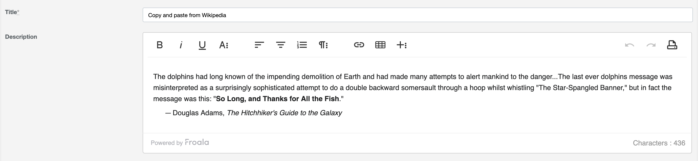

# ActiveAdmin Froala Editor [](https://badge.fury.io/rb/activeadmin_froala_editor) [](https://circleci.com/gh/blocknotes/activeadmin_froala_editor)

An Active Admin plugin to use [Froala WYSIWYG editor](https://github.com/froala/wysiwyg-editor) (jQuery required, font-awesome required & included). For Froala license / pricing see Froala website.

Features:
- permits to include an easy to use rich editor in Active Admin;
- customizable options via data attributes in the form input;
- plugins included, like images upload.



## Install
- Update your Gemfile: `gem 'activeadmin_froala_editor'` (and execute *bundle*)
- Add at the end of your ActiveAdmin styles (_app/assets/stylesheets/active_admin.scss_):
```css
@import 'font-awesome/font-awesome';
@import 'activeadmin/froala_editor_input';
```
- Add at the end of your ActiveAdmin javascripts (_app/assets/javascripts/active_admin.js_):
```js
//= require activeadmin/froala_editor/froala_editor.pkgd.min
//= require activeadmin/froala_editor_input
```
- Use the input with `as: :froala_editor` in Active Admin model conf

## Options
**data-options**: permits to set *froala editor* options directly - see [options list](https://www.froala.com/wysiwyg-editor/docs/options)

## Examples

```ruby
# ActiveAdmin article form conf:
  form do |f|
    f.inputs 'Article' do
      f.input :title
      f.input :description, as: :froala_editor
      f.input :published
    end
    f.actions
  end
```

Toolbar buttons configuration:

```ruby
f.input :description, as: :froala_editor, input_html: { data: { options: { toolbarButtons: ['undo', 'redo', '|', 'bold', 'italic'] } } }
```

Froala upload plugin: for the relevant files of an upload example see [here](examples/upload_plugin_using_activestorage/).
Consider that this is just a basic example: images are uploaded as soon as they are attached to the
 editor (regardless of the form submit), it shows the editor only for an existing record (because of
the *upload_admin_post_path*) and it doesn't provide a way to remove images (just deleting them from
the editor will not destroy them, you'll need to implement a purge logic for that).

## Notes
- To use this plugins with ActiveAdmin 1.x please use the version [0.1.3](https://github.com/blocknotes/activeadmin_froala_editor/releases/tag/v0.1.3)

## Do you like it? Star it!
If you use this component just star it. A developer is more motivated to improve a project when there is some interest.

Take a look at [other ActiveAdmin components](https://github.com/blocknotes?utf8=✓&tab=repositories&q=activeadmin&type=source) that I made if you are curious.

## Contributors
- [Mattia Roccoberton](http://blocknot.es): author
- The good guys that opened issues and pull requests from time to time

## License
- The gem is available as open-source under the terms of the [MIT](LICENSE.txt)
- For Froala editor License: see [Froala website](https://froala.com/wysiwyg-editor/)
