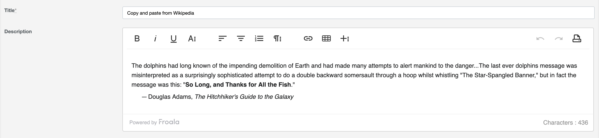

# ActiveAdmin Froala Editor
[](https://badge.fury.io/rb/activeadmin_froala_editor)
[](https://rubygems.org/gems/activeadmin_froala_editor)
[](https://github.com/blocknotes/activeadmin_froala_editor/actions/workflows/linters.yml)
[](https://github.com/blocknotes/activeadmin_froala_editor/actions/workflows/specs_rails70.yml)
[](https://github.com/blocknotes/activeadmin_froala_editor/actions/workflows/specs_rails80.yml)

An Active Admin plugin to use [Froala WYSIWYG editor](https://github.com/froala/wysiwyg-editor) (jQuery required, font-awesome required & included). For Froala license / pricing see Froala website.

Features:
- permits to include an easy to use rich editor in Active Admin;
- customizable options via data attributes in the form input;
- plugins included, like images upload.



Please :star: if you like it.

## Install

*NOTE*: if you are using Ruby < 3.0, please use Activeadmin Froala Editor 1.0.0

After installing Active Admin, add to your Gemfile: `gem 'activeadmin_froala_editor'` (and execute *bundle*)

If you installed Active Admin **without Webpacker** support:

- Add a SASS/SCSS gem to your Gemfile (ex. `gem 'sassc'`)
- Add at the end of your Active Admin styles (_app/assets/stylesheets/active_admin.scss_):
```css
@import 'font-awesome/font-awesome';
@import 'activeadmin/froala_editor_input';
```
- Add at the end of your Active Admin javascripts (_app/assets/javascripts/active_admin.js_):
```js
//= require activeadmin/froala_editor/froala_editor.pkgd.min
//= require activeadmin/froala_editor_input
```
- Use the input with `as: :froala_editor` in Active Admin model conf

Otherwise **with Webpacker**:

- Execute in your project root:

```sh
yarn add blocknotes/activeadmin_froala_editor
```

- Add to your *app/javascript/packs/active_admin.js*:

```js
require('activeadmin_froala_editor')
```

## Notes

- To use this plugins with Active Admin 1.x please use the version [0.1.3](https://github.com/blocknotes/activeadmin_froala_editor/releases/tag/v0.1.3)
- **data-options**: permits to set *froala editor* options directly from the form field (examples below) - see [options list](https://www.froala.com/wysiwyg-editor/docs/options)

## Examples

### Basic usage

```ruby
# Active Admin article form conf:
  form do |f|
    f.inputs 'Article' do
      f.input :title
      f.input :description, as: :froala_editor
      f.input :published
    end
    f.actions
  end
```

### Toolbar buttons configuration

```ruby
# Form field
f.input :description, as: :froala_editor, input_html: { data: { options: { toolbarButtons: ['undo', 'redo', '|', 'bold', 'italic'] } } }
```

### Froala upload plugin

```ruby
# Upload method (to be included in the admin entity configuration)
member_action :upload, method: [:post] do
  success = resource.images.attach(params[:file_upload])
  result = success ? { link: url_for(resource.images.last) } : {}
  render json: result
end
```

```ruby
# Form field
f.input :description, as: :froala_editor, input_html: { data: { options: { imageUploadParam: 'file_upload', imageUploadURL: upload_admin_post_path(resource.id), toolbarButtons: %w[bold italic underline | insertImage insertVideo insertFile] } } }
```

For the relevant files of an upload example see [here](examples/upload_plugin_using_activestorage/).
Consider that this is just a basic example: images are uploaded as soon as they are attached to the
 editor (regardless of the form submit), it shows the editor only for an existing record (because of
the *upload_admin_post_path*) and it doesn't provide a way to remove images (just deleting them from
the editor will not destroy them, you'll need to implement a purge logic for that).

## Changelog

The changelog is available [here](CHANGELOG.md).

## Development

Project created by [Mattia Roccoberton](http://blocknot.es), thanks also to the good guys that opened issues and pull requests from time to time.

There 3 ways to interact with this project:

1) Using Docker:

```sh
# Run rails server on the dummy app (=> http://localhost:3000 to access to ActiveAdmin):
make up
# Enter in a Rails console (with the dummy app started):
make console
# Enter in a shell (with the dummy app started):
make shell
# Run the linter on the project (with the dummy app started):
make lint
# Run the test suite (with the dummy app started):
make specs
# Remove container and image:
make cleanup
# To try different versions of Ruby/Rails/ActiveAdmin edit docker-compose.yml
# For more commands please check the Makefile
```

2) Using Appraisal:

```sh
export RAILS_ENV=development
# Install dependencies:
bin/appraisal
# Run server (or any command):
bin/appraisal rails s
# Or with a specific configuration:
bin/appraisal rails80-activeadmin rails s
```

3) With a local setup:

```sh
# Dev setup (set the required envs):
source extra/dev_setup.sh
# Install dependencies:
bundle update
# Run server (or any command):
bin/rails s
# To try different versions of Rails/ActiveAdmin edit extra/dev_setup.sh
```

## Do you like it? Star it!

If you use this component just star it. A developer is more motivated to improve a project when there is some interest. My other [Active Admin components](https://github.com/blocknotes?utf8=✓&tab=repositories&q=activeadmin&type=source).

Or consider offering me a coffee, it's a small thing but it is greatly appreciated: [about me](https://www.blocknot.es/about-me).

## License

The gem is available as open-source under the terms of the [MIT](LICENSE.txt).

For Froala editor License: see [Froala website](https://froala.com/wysiwyg-editor/).
