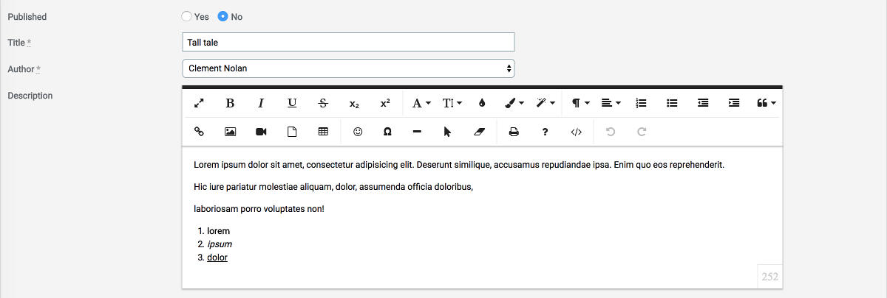

# ActiveAdmin Froala Editor [](https://badge.fury.io/rb/activeadmin_froala_editor)

An Active Admin plugin to use [Froala WYSIWYG editor](https://github.com/froala/wysiwyg-editor) (jQuery required, font-awesome required & included)



For Froala license / pricing see Froala website.

## Install

- Update your Gemfile: `gem 'activeadmin_froala_editor'` (and execute *bundle*)
- Add at the end of your ActiveAdmin styles (_app/assets/stylesheets/active_admin.scss_):
```css
@import 'font-awesome/font-awesome';
@import 'activeadmin/froala_editor_input';
```
- Add at the end of your ActiveAdmin javascripts (_app/assets/javascripts/active_admin.js_):
```js
//= require activeadmin/froala_editor/froala_editor.pkgd.min
//= require activeadmin/froala_editor_input
```
- Use the input with `as: :froala_editor` in Active Admin model conf

Why 2 separated scripts? In this way you can include a different version of *froala editor* if you like. The same for FontAwesome.

## Options

**data-options**: permits to set *froala editor* options directly - see [options list](https://www.froala.com/wysiwyg-editor/docs/options)

## Examples

```ruby
# ActiveAdmin article form conf:
  form do |f|
    f.inputs 'Article' do
      f.input :title
      f.input :description, as: :froala_editor
      f.input :published
    end
    f.actions
  end
```

Toolbar buttons configuration:

```ruby
f.input :description, as: :froala_editor, input_html: {data: {options: {toolbarButtons: ['undo', 'redo', '|', 'bold', 'italic']}}}
```

## Notes

- *Code View* function doesn't work properly with this plugin

- For upload functions (Images, Documents, Files, etc.) see Froala docs

## Do you like it? Star it!

If you use this component just star it. A developer is more motivated to improve a project when there is some interest.

Take a look at [other ActiveAdmin components](https://github.com/blocknotes?utf8=✓&tab=repositories&q=activeadmin&type=source) that I made if you are curious.

## Contributors

- [Mattia Roccoberton](http://blocknot.es) - creator, maintainer

## License

Froala License: see Froala website

Plugin License: [MIT](LICENSE.txt)
